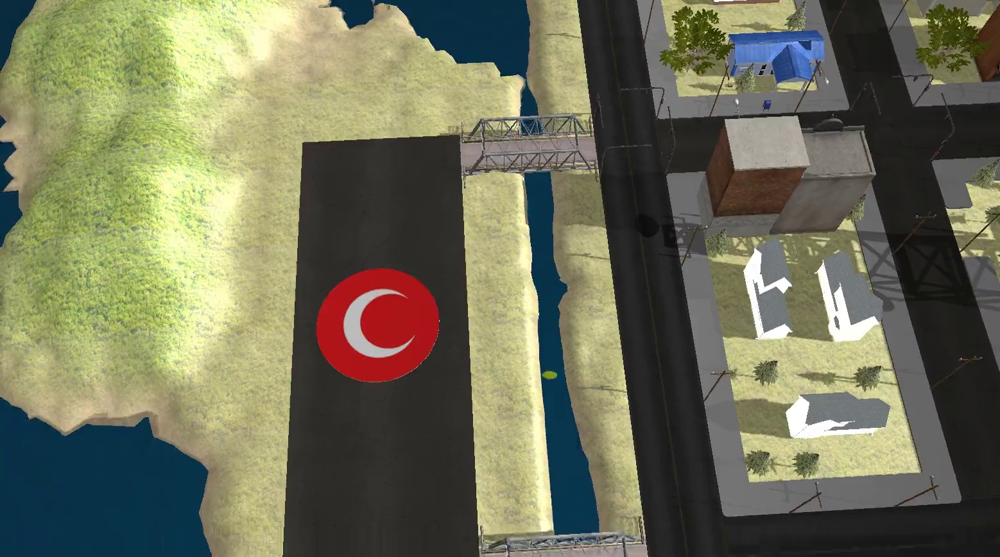
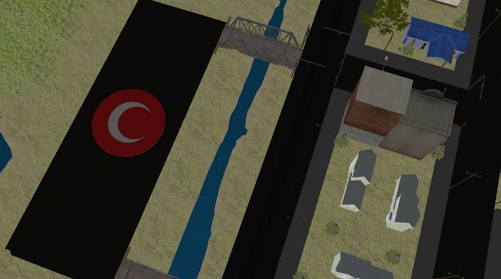
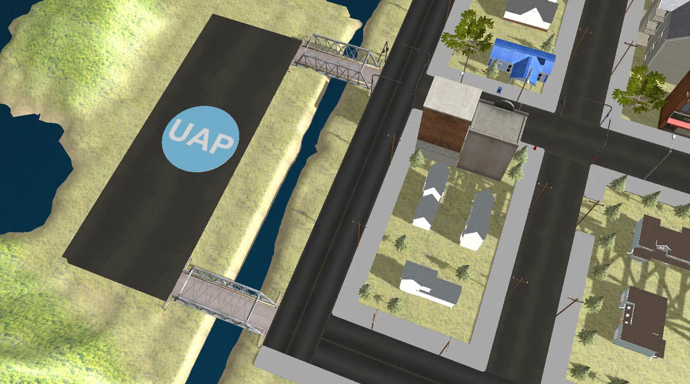
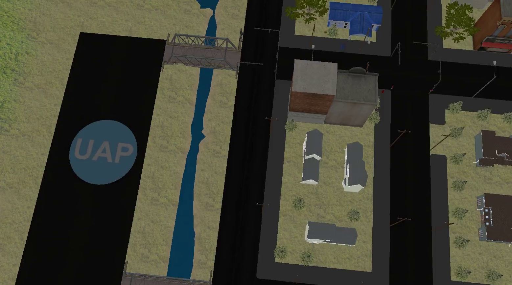

# GAZEBO-UAP-UAI-DATASET


Synthetic UAP/UAI dataset generated from Gazebo simulation environments for computer vision and AI research.

---

## Project Description

This repository provides an unlabeled raw image frame dataset collected from Gazebo simulation environments, containing UAP/UAI scenarios captured under both illuminated and non-illuminated conditions.

The project was prepared for TEKNOFEST Artificial Intelligence in Aviation competition and includes simulation videos together with extracted image frames generated using OpenCV.

Although the dataset is currently unlabeled, the extracted frames can be annotated in the future for object detection and deep learning studies.

---

## Dataset Structure

```bash
GAZEBO-UAP-UAI-DATASET/
│
├── extracted_frames/
│   ├── UAI_ISIKLI/
│   ├── UAI_ISIKSIZ/
│   ├── UAP_ISIKLI/
│   └── UAP_ISIKSIZ/
│
├── samples/
│   ├── uai_light.jpg
│   ├── uai_dark.jpg
│   ├── uap_light.jpg
│   └── uap_dark.jpg
│
├── scripts/
│   └── extract_frames.py
│
├── videos/
│   ├── UAI_ISIKLI.mp4
│   ├── UAI_ISIKSIZ.mp4
│   ├── UAP_ISIKLI.mp4
│   └── UAP_ISIKSIZ.mp4
│
└── README.md
```

---

## Dataset Features

- Gazebo simulation environment
- UAP / UAI scenarios
- Different illumination conditions
- Automatic frame extraction
- Synthetic image dataset
- Suitable for future YOLO annotation studies

---

## Dataset Statistics

| Category | Frame Count |
|---|---|
| UAI_ISIKLI | 500 |
| UAI_ISIKSIZ | 500 |
| UAP_ISIKLI | 500 |
| UAP_ISIKSIZ | 500 |
| Total | 2000 |

---

---

## Sample Frame

| UAI Light | UAI Dark |
|---|---|
|  |  |

| UAP Light | UAP Dark |
|---|---|
|  |  |

---

## Data Generation Pipeline

```text
Gazebo Simulation
        ↓
Video Recording
        ↓
Frame Extraction (OpenCV)
        ↓
Image Dataset Generation
        ↓
Future Annotation Pipeline
```

---

## Frame Extraction

Frames were extracted from videos using OpenCV.

Frames were extracted at fixed intervals using OpenCV to preserve temporal diversity while reducing redundant samples.

Install requirements:

```bash
pip install opencv-python
```

Run the extraction script:

```bash
python scripts/extract_frames.py
```

Each video generates 500 frames.

---

## Current Status

This repository currently contains raw extracted image frames.

The dataset is not annotated yet due to time limitations, but it can be labeled in the future for:

- Object Detection
- YOLO Training
- Computer Vision Research
- Deep Learning Experiments

---

## Technologies Used

- Gazebo
- ROS
- Python
- OpenCV

---

## Author

Fatmanur Yılmaz

Computer Engineering Student